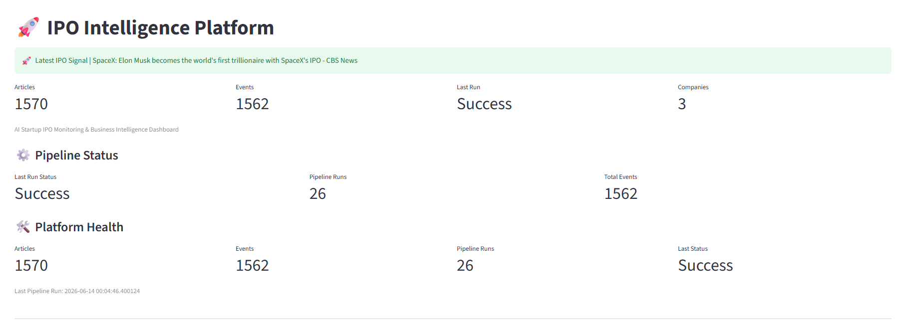
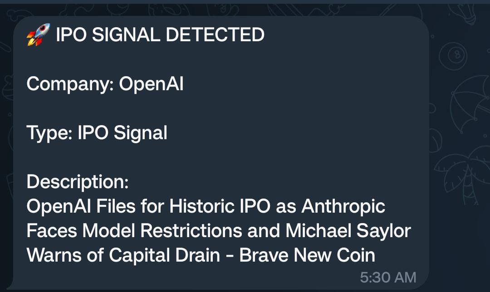
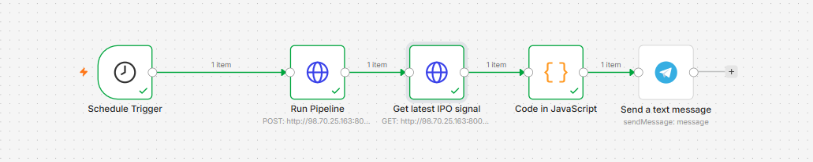
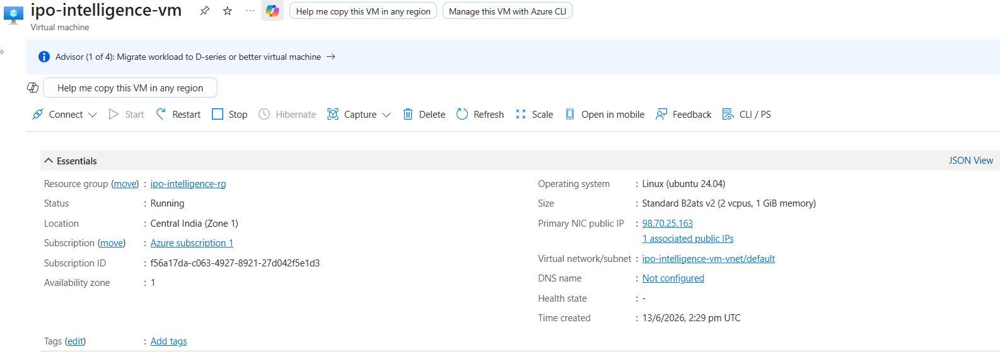
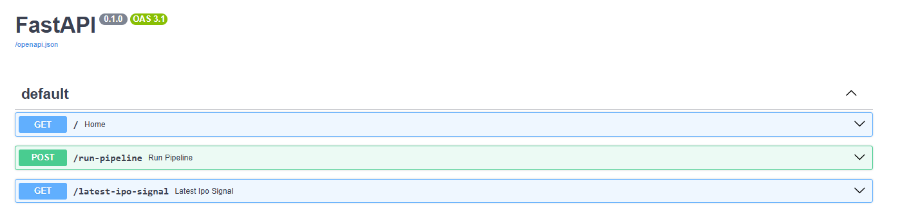

# 🚀 IPO Intelligence Platform

## Overview

IPO Intelligence Platform is a cloud-hosted intelligence system that continuously monitors AI industry news, detects IPO-related signals, stores structured events, visualizes insights through an interactive dashboard, and delivers real-time alerts through Telegram.

The platform automates the entire intelligence lifecycle:

* Data Collection
* Event Detection
* Signal Generation
* Data Storage
* Dashboard Visualization
* Alerting & Automation

The system is deployed on Microsoft Azure and operates autonomously through scheduled workflows.

---
# Screenshots

## Dashboard



---

## Telegram Alert



---

## n8n Workflow



---

## Azure Deployment



---

## FastAPI API Documentation



# Architecture

```text
RSS News Sources
        │
        ▼
Python Collectors
(OpenAI, Anthropic, SpaceX)
        │
        ▼
FastAPI Backend
        │
        ▼
Supabase PostgreSQL
        │
        ├─────────────► Streamlit Dashboard
        │
        └─────────────► IPO Signal Detection
                              │
                              ▼
                           n8n
                              │
                              ▼
                     Telegram Alerts
```

---

# Features

## Automated Data Collection

The platform continuously collects news from multiple sources for target companies.

Current companies monitored:

* OpenAI
* Anthropic
* SpaceX

Data sources include:

* RSS Feeds
* Google News
* Company News Sources

---

## Event Detection Engine

Raw news articles are automatically transformed into structured business events.

Examples:

| Event Type        | Example                            |
| ----------------- | ---------------------------------- |
| IPO Signal        | Company files for IPO              |
| Acquisition       | Company acquires startup           |
| Partnership       | Strategic partnership announcement |
| Funding Round     | New investment round               |
| Product Launch    | New product release                |
| Regulatory Action | Government action                  |
| Legal Issue       | Litigation or legal concerns       |

---

## IPO Signal Detection

The platform automatically identifies news that may indicate IPO activity.

Example:

```text
OpenAI Files for Historic IPO as Anthropic Faces Model Restrictions
```

Detected as:

```text
IPO Signal
```

These signals are prioritized and exposed through the dashboard and Telegram alerts.

---

## Interactive Dashboard

Built using Streamlit.

Dashboard capabilities:

* Latest IPO Signal Banner
* Company Event Analytics
* Event Distribution Charts
* Pipeline Health Monitoring
* Recent IPO Signals
* Company Leaderboard
* Platform Metrics

---

## Telegram Alerting

The system automatically sends Telegram notifications whenever a new IPO signal is detected.

Example Alert:

🚀 IPO SIGNAL DETECTED

Company: OpenAI

Type: IPO Signal

Description:
OpenAI Files for Historic IPO as Anthropic Faces Model Restrictions and Michael Saylor Warns of Capital Drain

Duplicate alert prevention ensures that the same signal is never sent multiple times.

---

## Workflow Automation

Powered by n8n.

Automated Workflow:

```text
Hourly Trigger
      │
      ▼
Run Pipeline
      │
      ▼
Generate Events
      │
      ▼
Detect IPO Signals
      │
      ▼
Send Telegram Alert
```

---

# Technology Stack

## Backend

* Python 3.12
* FastAPI
* SQLAlchemy

## Database

* Supabase PostgreSQL

## Dashboard

* Streamlit
* Pandas

## Automation

* n8n

## Infrastructure

* Microsoft Azure VM

## Notifications

* Telegram Bot API

---

# API Endpoints

## Run Pipeline

```http
POST /run-pipeline
```

Triggers the intelligence pipeline.

Response:

```json
{
  "success": true,
  "message": "Pipeline started in background"
}
```

---

## Latest IPO Signal

```http
GET /latest-ipo-signal
```

Returns the most recent IPO signal.

Example:

```json
{
  "found": true,
  "id": 1542,
  "company": "OpenAI",
  "type": "IPO Signal",
  "description": "OpenAI Files for Historic IPO..."
}
```

---

# Database Schema

## Articles

Stores collected news articles.

Fields:

* id
* company_name
* headline
* source
* url

---

## Events

Stores detected business events.

Fields:

* id
* company_name
* event_type
* description

---

## Pipeline Runs

Stores execution history.

Fields:

* id
* status
* articles_processed
* events_created

---

# Deployment

## Cloud Environment

Platform hosted on:

* Microsoft Azure Virtual Machine

Services:

* FastAPI API
* Streamlit Dashboard

Database:

* Supabase PostgreSQL

---

# Project Highlights

✅ Cloud Hosted

✅ Automated Data Pipeline

✅ Event Detection Engine

✅ IPO Signal Detection

✅ FastAPI REST API

✅ Interactive Dashboard

✅ Telegram Alerting

✅ Workflow Automation with n8n

✅ Duplicate Alert Prevention

✅ Production Database

---

# Future Enhancements

* AI-powered sentiment analysis
* IPO probability scoring
* Multi-company watchlists
* Slack integration
* Email notifications
* User authentication
* Historical trend forecasting
* Advanced analytics dashboard
* Docker deployment
* CI/CD pipeline

---

# Author

Soumyadutta Dash

AI Automation Engineer | Data Engineering Enthusiast

Built as an end-to-end cloud intelligence platform demonstrating:

* Data Engineering
* Backend Development
* Cloud Deployment
* Workflow Automation
* Event Intelligence Systems
